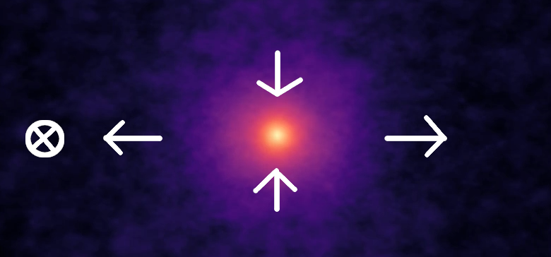

# cusp-encounters
Code for evaluating the effect of stellar encounters on prompt cusps. For details please read [Stücker et al. (2023)](https://arxiv.org/abs/2301.04670). 

You can find a explanatory YouTube video [here](https://youtu.be/Y1t2QHmOyEo):

[](https://youtu.be/Y1t2QHmOyEo)

Prompt cusps are dark matter haloes which have masses of order earth masses, extents of order 1000 AU (astronomical units) and steep -3/2 powerlaw density profiles. In the central ~2AU there is a finite core with a maximum density due to the primordial velocity dispersion of dark matter. Prompt cusps are expected to be extremely abundant -- e.g. we expect that 10^16 such objects are orbiting inside the Milky Way -- much larger than the number of stars or planets.

When a star closely passes by a prompt cusp, it causes a shock, almost instantaneously modifying the velocities of particles. A typical stellar encounter takes 100-1000 years whereas the orbital time-scales inside the prompt cusp are of order 10k years or much more. This causes many of the particles to escape the system and only a smaller remnant remains. 

This code can be used to
* Create distributions of prompt cusps
* Integrate their orbits in a Milky Way environment
* Sample the distribution of shocks from stellar encounters
* Evaluate the effect of such stellar encounters on the annihilation radiation expected from prompt cusps
* Generate initial conditions for idealized simulations of prompt cusps

## Content:

* [cusp_encounters](cusp_encounters): Contains all the important python module files.
* [notebooks](notebooks): Contains notebooks that show how to use the code and how to recreate (almost) all plots from the paper
    - [notebooks/cusp_distribution.ipynb](notebooks/cusp_distribution.ipynb): Create distributions of the structural parameters of prompt cusps (~Section 2 of the paper)
    - ([notebooks/create_orbits_mpi.py](notebooks/create_orbits_mpi.py): A python script (with MPI support) for creating and saving a set of orbits)
    - [notebooks/milkyway_orbits.ipynb](notebooks/milkyway_orbits.ipynb): Milky Way model + orbit stability tests + evaluation of parameters needed for the shock histories (~Section 3 of the paper)
    - [notebooks/encounter_distribution.ipynb](notebooks/encounter_distribution.ipynb): The distribution of stellar encounters (~Section 2+3)
    - [notebooks/annihilation_results.ipynb](notebooks/annihilation_results.ipynb): Evaluation of the annihilation luminosities of prompt cusps (after stellar encounters) in the Milky Way. This includes the main results of the paper. (~Section 5 of the paper)
    - [notebooks/simulation_initial_conditions.ipynb](notebooks/simulation_initial_conditions.ipynb): A short example that shows how to create initial conditions (with non-uniform mass sampling) for cored profiles and powerlaw profiles. (~Appendix A1)
    - [notebooks/smooth_tides.ipynb](notebooks/smooth_tides.ipynb): Use the [Adiabatic-Tides](https://arxiv.org/abs/2207.00604) model to predict the joint effect of stellar encounters + smooth tides (~Appendix B)
* [data](data): Contains some data tables
* [caches](caches): Contains some .hdf5 files to store precalculated results. In principle, you can delete this at the cost of needing to recalculate results
* [adiabatic-tides](adiabatic-tides) A submodule-reference to the [Adiabatic-Tides](https://github.com/jstuecker/adiabatic-tides) repository. We use this to estimate the effect of smooth tides.
* [init.sh](init.sh) A short bash script for initializing some additional data.

## Getting Started:
Please clone the repository with the option "--recurse-submodules". E.g.
```
git clone --recurse-submodules https://github.com/jstuecker/cusp-encounters.git
```
If you forget to add this option when cloning, you can also get the submodules afterwards with
```
git submodule init
git submodule update
```
Afterwards you should execute the following short shell script. You may want to check the contents and execute things line by line. If something does not work, some of the comments might help you.
```
./init.sh
```
This installs some packages and downloads some precomputed results. In principle you can recompute these results by yourself. However, especially the orbit integration will take a while (~ a few ours on multiple CPUs). If you download the precomputed caches most things can be executed within a couple of minutes.

After reading the paper, I recommend going through the notebooks above, roughly in the order that they are listed.

## Requirements:
* pip
The following packages can be installed automatically
* numpy
* scipy
* matplotlib
* classy
* h5py
* gdown (optional)
* mpi4py (optional)

## Acknowledgement:
If you use this code, please cite the paper [Stücker et al. (2023)](https://arxiv.org/abs/2301.04670). Additionally there are other works used inside of this repository. Therefore, you should cite these as well if you use the corresponding parts of the code:

* The [Adiabatic-Tides](https://github.com/jstuecker/adiabatic-tides) repository. This is used for evaluating the effect of smooth tides. [Stücker et al. (2022)](https://arxiv.org/abs/2207.00604)
* Gammaray data of the Galactic Centre Excess under [data/di_mauro_fig10.txt](data/di_mauro_fig10.txt) which was provided by [Di Mauro (2021)](https://journals.aps.org/prd/abstract/10.1103/PhysRevD.103.063029)
* Data of the Isotropic Gamma Ray Background under [data/apj504089t3_mrt.txt](data/apj504089t3_mrt.txt). This file is not available under the MIT license. [Ackermann et al. (2015)](https://iopscience.iop.org/article/10.1088/0004-637X/799/1/86)
* While I have not used directly any code from from the [microhalo-models](https://github.com/delos/microhalo-models) repository from Sten Delos, I have carefully checked my implementation against the results from that code. If you use the code for sampling the distributions of cusps, probably you should cite [Delos et al (2019)](https://arxiv.org/abs/1905.05766) and [Delos & White (2022)](https://arxiv.org/abs/2209.11237), since these presented the corresponding theoretical considerations.
* To get a power spectrum we also use the CLASS code [Blas et al. (2011)](https://arxiv.org/abs/1104.2933)
